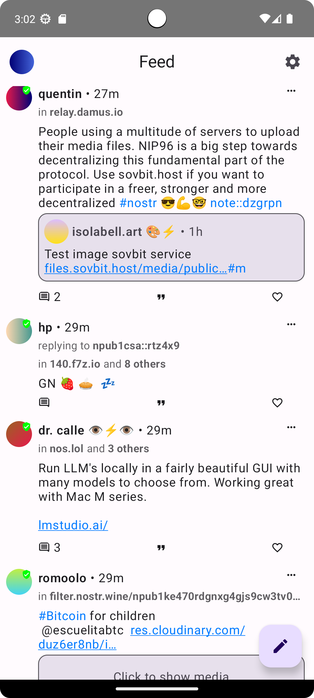
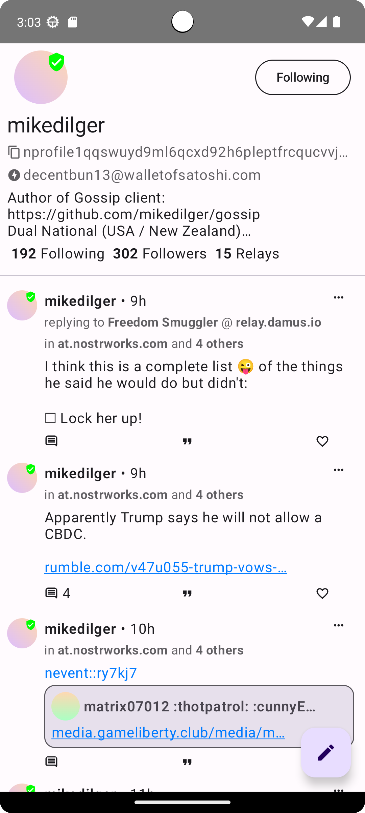
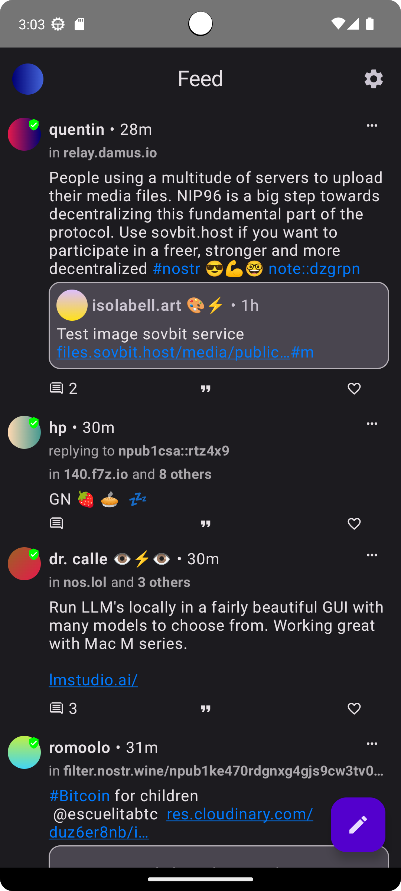
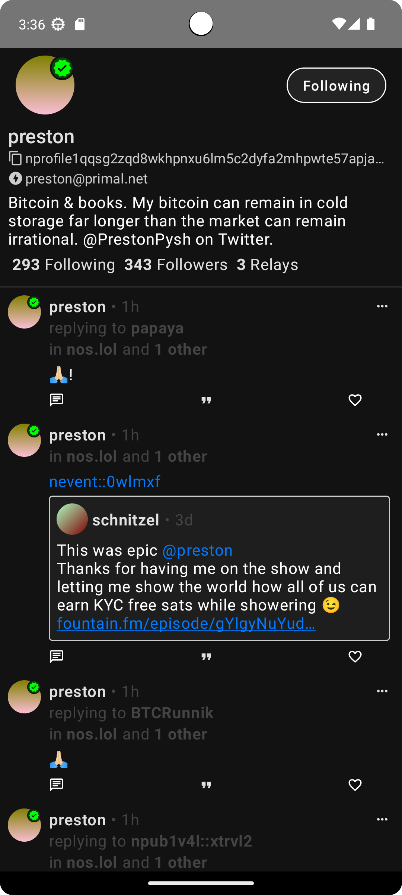

# Nozzle

Nozzle is a lightweight nostr client for Android.

## Installation

Go to the [release page](https://github.com/dluvian/Nozzle/releases) and download the latest apk
file or clone this repository and build it yourself.

## Screenshots

## Contributing

Contributors are very welcome.

## License

[MIT licence](https://github.com/dluvian/Nozzle/blob/master/LICENSE)
