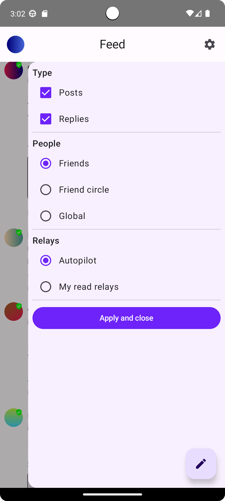

# Nozzle

Nozzle is a lightweight nostr client for Android.

## Installation

Install it via [Obtainium](https://github.com/ImranR98/Obtainium) or go to
the [release page](https://github.com/dluvian/Nozzle/releases) and download the latest apk file.

I don't plan to publish this app in the Google Play Store.

## Some points of difference

- Outbox model: Nozzle discovers relays through nip-65 events, reply relay hints and encoded relays
  in nprofiles/nevents. It fetches data only from relays expected to contain the desired
  information.
- Relay transparency: Nozzle will show you in which relays each note has been seen on and which
  reply relay hint has been set for each reply. Additionally, users can see and limit the relays to
  which they wish to send a post or reply.
- Mobile data friendly: Profile pictures are not rendered, pictures are only loaded when the user
  decides to, reactions of other people will not be fetched and the number of relay connections to
  fetch the feed is minimized.
- Trust indicator: Each profile has a colored badge in the top-right of their identicon which
  indicates their trust level.
    - Green check: You follow this profile (trust him).
    - Orange check: You don't follow this profile, but at least one of the people you follow
      (friend) does. The green background section expands proportionally based on the percentage of
      your friends following this profile. If 90.9% or more of your friends follow this person, the
      background will be fully green.
    - Grey question mark: You don't follow this profile and neither do any of your friends. Replies
      from these profiles appear at the end of a thread.
- Small apk size of less than 9MB

## Supported (and partially supported) nips

- [NIP-01: Basic protocol flow description](https://github.com/nostr-protocol/nips/blob/master/01.md)
- [NIP-02: Follow List](https://github.com/nostr-protocol/nips/blob/master/02.md)
- [NIP-09: Event Deletion](https://github.com/nostr-protocol/nips/blob/master/09.md)
- [NIP-10: Conventions for clients' use of e and p tags in text events](https://github.com/nostr-protocol/nips/blob/master/10.md)
- [NIP-11: Relay Information Document](https://github.com/nostr-protocol/nips/blob/master/11.md)
- [NIP-18: Reposts](https://github.com/nostr-protocol/nips/blob/master/18.md)
- [NIP-19: bech32-encoded entities](https://github.com/nostr-protocol/nips/blob/master/19.md)
- [NIP-21: nostr: URI scheme](https://github.com/nostr-protocol/nips/blob/master/21.md)
- [NIP-25: Reactions](https://github.com/nostr-protocol/nips/blob/master/25.md)
- [NIP-27: Text Note References](https://github.com/nostr-protocol/nips/blob/master/27.md)
- [NIP-42: Authentication of clients to relays](https://github.com/nostr-protocol/nips/blob/master/42.md)
- [NIP-65: Relay List Metadata](https://github.com/nostr-protocol/nips/blob/master/65.md)

## Screenshots

## Contributing

Contributors are very welcome.

## License

[MIT licence](https://github.com/dluvian/Nozzle/blob/master/LICENSE)
